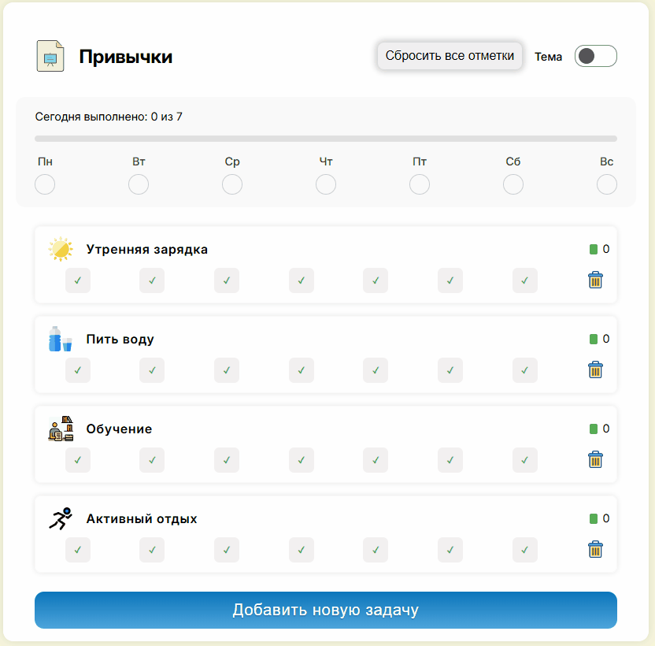

# Habit Tracker

Веб-приложение для отслеживания привычек и ежедневного прогресса.
 
## Функционал 

- Добавление и удаление карточек с привычками + автоудаление карточки задачи при нажатии всех кликов(галочек)
- Отметка прогресса по дням недели с подсчётом результатов
- Прогресс-бар и счётчик выполненных дней
- Сохранение состояния в браузере (localStorage)
- Кнопка сброса для очистки всех привычек и прогресса

## Технологии 

- HTML
- Sass (SCSS)
- JavaScript (без фреймворков)

## Цель проекта 
- Показать навыки работы с DOM, событиями и хранением данных в localStorage.
##
  
  
